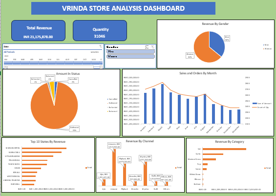
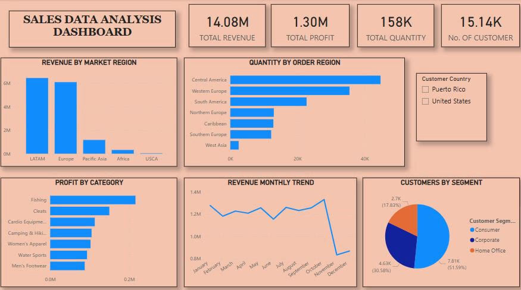

# Project 1

**Title:** [Vrinda Store Analysis Dashboard](https://github.com/Pelz23/github.io/blob/main/Vrinda%20Store%20(Unclean).xlsx)

**Tools used:** Microsoft Excel (Pivot Table, Slicers, Pivot chart, Timeline, Formulas)

**Project description:**
This project delivers an end‑to‑end analytical review of Vrinda Store’s 2020 sales dataset with the objective of uncovering customer trends and generating insights that can support strategic sales growth in 2023. The analysis includes a comparative study of monthly sales and order volumes, identification of peak‑performing months, and evaluation of gender‑based purchasing behaviour.

It further investigates order status patterns, highlights the top 10 states contributing to total revenue, and examines the relationship between customer age groups and gender in relation to order frequency. Additionally, the project assesses the performance of various sales channels to determine which platforms drive the highest sales and identifies the best‑selling product categories.

The insights generated from this analysis provide Vrinda Store with a data‑driven foundation for improving customer segmentation, refining marketing strategies, and optimising product offerings.

**Findings:**

The Vrinda Store Data Analysis reveals valuable insights into customer behaviour and sales performance for the year 2020. The store achieved a total revenue of ₹21,175,878 from 31,046 orders, with women contributing the majority of purchases. March recorded the highest sales and order volume, indicating a seasonal peak in demand. Most orders were successfully delivered, reflecting strong operational efficiency and customer satisfaction. Amazon and Flipkart emerged as the leading sales channels, while a few top-performing states accounted for a significant share of total revenue. The analysis also identified one dominant product category driving sales growth. Overall, these findings highlight Vrinda Store’s strengths in female customer engagement, reliable delivery processes, and effective use of major e-commerce platforms, providing a solid foundation for strategic planning and targeted marketing in 2023.

**Dashboard overview:**

# Project 2

**Title:** Employee Data Interrogation and Manipulation

**SQL codes:**

[Employee SQL code](https://github.com/Pelz23/github.io/blob/main/employee.sql)

**SQL skills used:**

Data Retrieval (SELECT): Queried and extracted specific information from the database
Data Filtering (WHERE) : Applied filter to select relevant data, including filtering by range and lists
Data Source Specification (FROM): Specified the tables used as data sources for retrieval
Data Sorting (ORDER BY): sorts results in ascending or descending order
String Functions (Upper,Lower):  transform text values

**Project description:**

This project involved writing a series of SQL queries to explore, filter, and organise data from multiple tables within a relational database. The tasks focused on retrieving meaningful information using essential SQL operations such as SELECT, WHERE, ORDER BY, LIMIT, and string‑manipulation functions like UPPER() and LOWER().

The queries extracted key business information including product categories, customer details, employee records, order transactions, supplier data, and stock availability. Several conditions were applied to filter records, such as selecting customers from specific cities, identifying out‑of‑stock products, retrieving orders placed on a particular date, and finding orders shipped later than required. Sorting techniques were used to organise results alphabetically, chronologically, and by numerical values such as freight cost.

Overall, the project demonstrates strong foundational SQL skills, including data retrieval, conditional filtering, text formatting, and result sorting. These queries reflect the ability to navigate a database, extract insights, and prepare structured reports that support business decision‑making.

**Technology Used: SQL Server** 

# Project 3

**Title:** [Sales Data Analysis Dashboard](https://github.com/Pelz23/github.io/blob/main/Sales%20Data.xlsx)

**PowerBI skills used:** 

Data Import & Transformation (Data extraction, Data cleaning)
DAX (Data Analysis Expressions): Calculated measures, aggregated functions
Data Visualisation & Dashboard Design (Barchart, Line chart, Pie chart,)
Interactivity & User Experience (Slicers)

**Project description:**

**Findings:**

The sales performance analysis provides a comprehensive view of the company’s operational and commercial health, revealing strong overall results with 14.08M in revenue, 1.30M in profit, and over 158K units sold to more than 15K customers. The findings highlight LATAM and Europe as the organisation’s most profitable and high‑demand regions, while other markets present opportunities for strategic growth. Product profitability varies significantly, with Fishing and Coats emerging as the strongest categories, whereas Water Sports and Men’s Footwear underperform and may require targeted improvement strategies. Monthly revenue trends indicate seasonal fluctuations that should inform future promotional planning. Customer segmentation shows that the Consumer segment drives the majority of sales, supported by meaningful contributions from Corporate clients. Overall, the analysis equips the business with clear, data‑driven insights to strengthen high‑performing areas, address weaknesses, and guide strategic decision‑making for sustained growth.

**Dashboard overview:**

